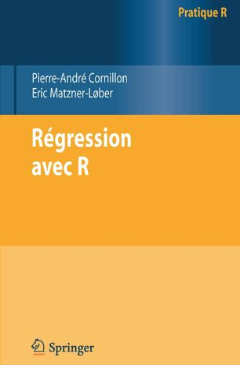

<h2 id="descriptif">Descriptif</h2>
<ul>
<li><a href="/pdf/4eme_COUV.pdf">4e de couverture</a></li>
<li><a href="/pdf/Avant-propos.pdf">Avant-propos</a></li>
<li><a href="/pdf/TableDesMatieres.pdf">Sommaire détaillé</a></li>
</ul>

<h2 id="auteurs">Les auteurs</h2>
<a href="https://perso.univ-rennes2.fr/pierre-andre.cornillon">Pierre-André Cornillon</a>, 
Nicolas Hengartner,
<a href="https://www.researchgate.net/profile/E_Matzner-Lober">Eric Matzner-Lober</a>, 
<a href="https://perso.univ-rennes2.fr/laurent.rouviere">Laurent Rouvière</a>

<h2 id="auteurs">Boutique en ligne</h2>

[<a href="https://www.edpsciences.org/fr/livres">Par ici!</a>]

<h2 id="matériel-disponible">Matériel disponible</h2>

<ul>
<li><a href="/liste_don.html">Jeux de données</a></li>
<li><a href="/code_html/code.html">Ligne de code utilisées dans les chapitres (y compris les fiches)</a></li>
<li><a href="correction_exo_html/correction_exo.html">Proposition de correction des exercices</a></li>
<li><a href="https://regression-avec-r.github.io/correction_exo_html/correction_exo.md">Test</a></li>
<li><a href="https://regression-avec-r.github.io/correction_exo_html/correction_exo.html">Test2</a></li>

<li><a href="geocodeGratuit.R">Fonction permettant d'obtenir la géolocalisation (latitudes et longitudes) d'adresses</a></li>
</ul>

  * [test](correction.md)
  * [test1](correction_exo_html/correction_exo.md)

